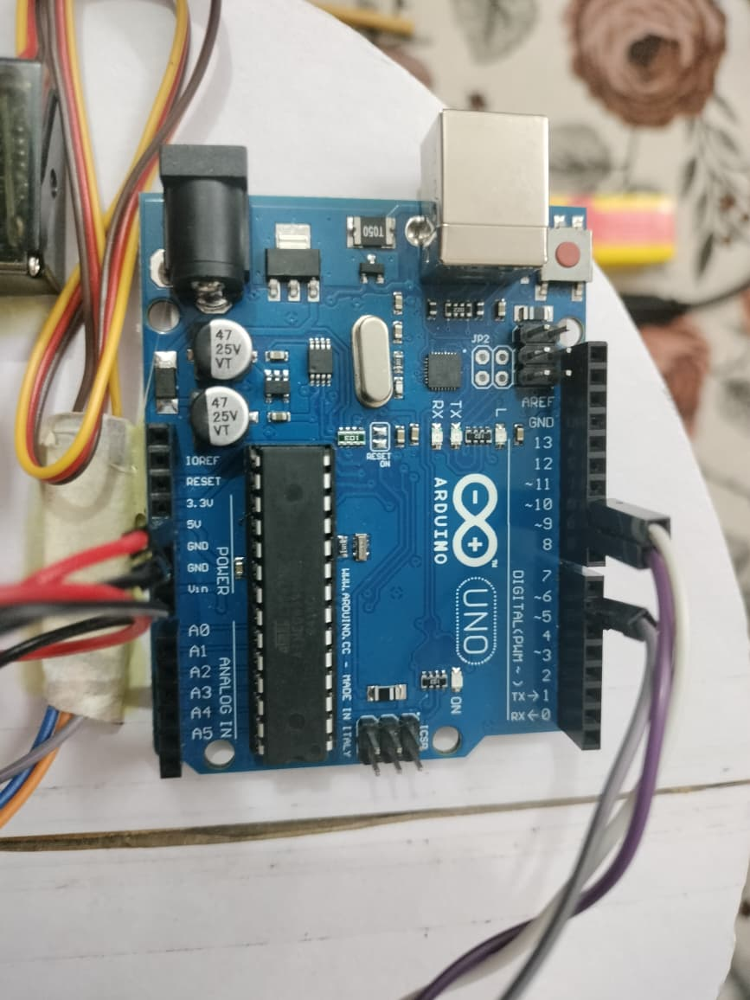
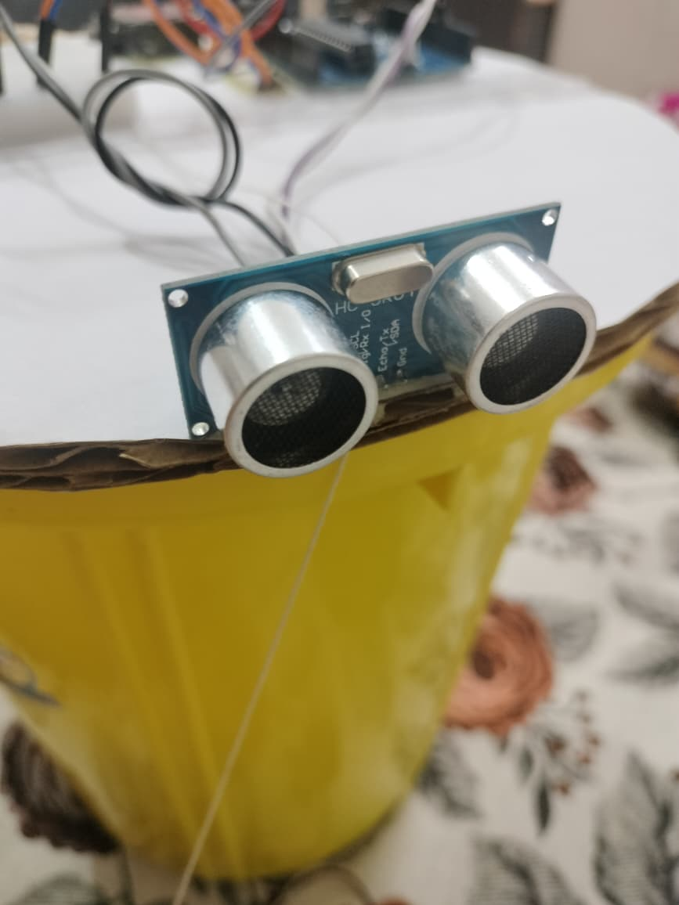
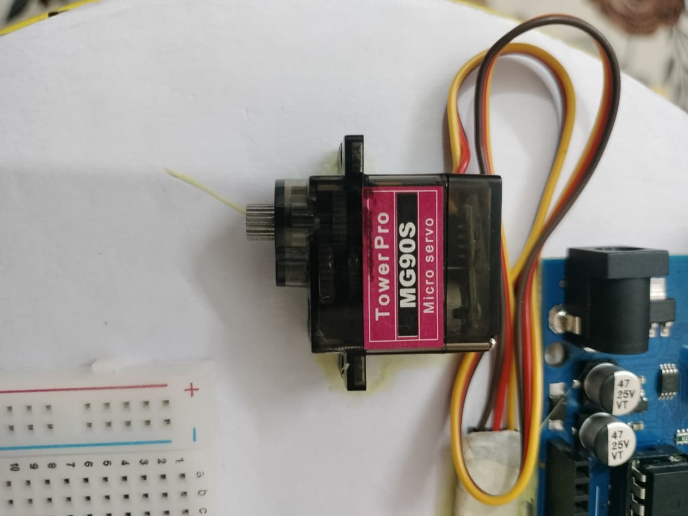
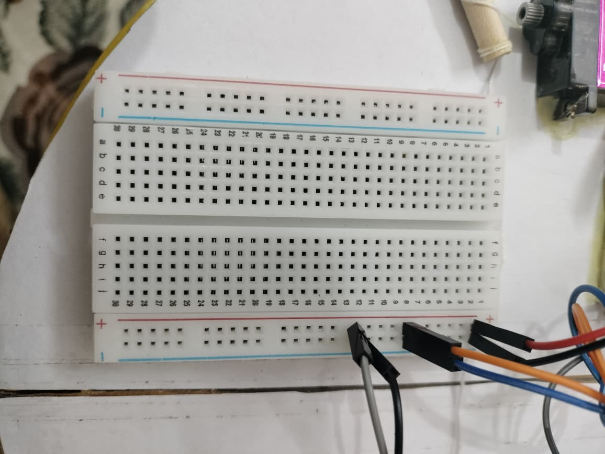

# Smart Dustbin 🗑️

An intelligent dustbin that automatically opens its lid when it detects an object nearby using ultrasonic sensor technology.



## Features

- **Automatic Lid Control**: Opens lid when object is detected within 10cm
- **Ultrasonic Detection**: Uses HC-SR04 ultrasonic sensor for precise distance measurement
- **Servo Motor Control**: Smooth lid opening/closing mechanism
- **Real-time Monitoring**: Serial output for distance measurements and debugging
- **Energy Efficient**: Only activates when needed

## Hardware Components

- Arduino Uno/Nano
- HC-SR04 Ultrasonic Sensor
- SG90 Servo Motor
- Jumper wires
- Breadboard (optional)
- Dustbin with lid mechanism

## Circuit Connections

| Component | Arduino Pin |
|-----------|-------------|
| HC-SR04 Trig | Pin 9 |
| HC-SR04 Echo | Pin 10 |
| Servo Signal | Pin 6 |
| HC-SR04 VCC | 5V |
| HC-SR04 GND | GND |
| Servo VCC | 5V |
| Servo GND | GND |

### Circuit Assembly


## Installation & Setup


1. **Hardware Setup**
   - Connect components according to the circuit diagram in `/docs/`
   - Ensure proper power supply (5V for servo and sensor)
   - Mount the ultrasonic sensor at appropriate height on dustbin

2. **Software Setup**
   - Install Arduino IDE
   - Open `src/smart_dustbin.ino`
   - Install required libraries (Servo library is built-in)
   - Upload code to Arduino

3. **Calibration**
   - Adjust the distance threshold in the code if needed (currently set to 10cm)
   - Test the servo angle positions (0° and 180°)

## Usage

1. Power on the Arduino
2. The dustbin lid will remain closed initially
3. When you approach within 10cm, the lid automatically opens
4. The lid stays open for 2.5 seconds, then closes
5. Monitor serial output (9600 baud) for distance readings

### Project Gallery




## Code Structure

```
src/
├── smart_dustbin.ino    # Main Arduino sketch
└── libraries/           # Custom libraries (if any)
```

## Customization

- **Distance Threshold**: Modify the `distance < 10` condition in the main loop
- **Servo Angles**: Adjust `myServo.write(0)` and `myServo.write(180)` values
- **Delay Timing**: Change the `delay(2500)` for different lid-open duration
- **Sensor Sensitivity**: Modify the ultrasonic sensor reading logic

## Troubleshooting

- **Servo not moving**: Check power supply and connections
- **Inaccurate distance readings**: Ensure sensor is properly mounted and clean
- **Lid not opening**: Verify servo angle range and mechanical setup
- **Serial not working**: Check baud rate (9600) and USB connection

## Media

### Photos
- **Main Project**: `media/images/IMG-20250829-WA0013.jpg` - Overview of the smart dustbin project
- **Circuit Setup**: `media/images/IMG-20250829-WA0014.jpg` - Hardware connections and wiring
- **In Action**: `media/images/IMG-20250829-WA0015.jpg` - Smart dustbin operating
- **Final Assembly**: `media/images/IMG-20250829-WA0016.jpg` - Completed project

### Videos
Check the `/media/videos/` folder for demonstration videos:
- Project demonstration videos
- Circuit testing footage
- Assembly process recordings

## Author

Aditya Sharma - aditya1401sharma@gmail.com

## Acknowledgments

- Arduino community for excellent documentation
- Open source hardware movement
- Contributors and testers
